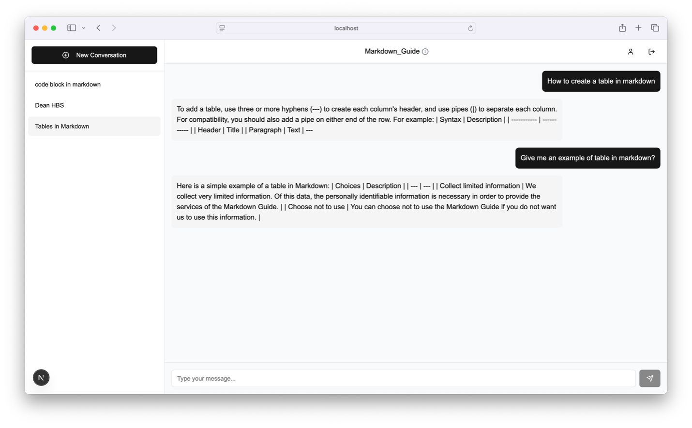
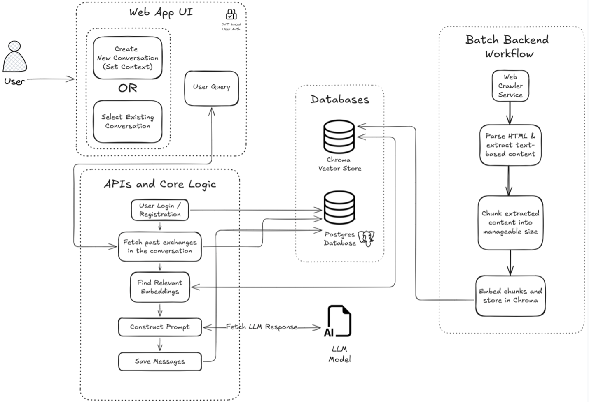

# RAG-based Chat Interface

A lightweight web-based chat interface powered by a Retrieval-Augmented Generation (RAG) pipeline.

This project was built as a personal learning exercise to gain hands-on experience working with Large Language Models (LLMs), Embedding Models, Vector databases and related technologies.

---

Here's quick look at the interface:

## What it does?

This application allows users to query custom knowledge bases via a simple chat interface. It works by:

1. **Extract** content by crawling links from a base URL.
2. **Embedding** extracted content using an embedding model.
3. **Indexing** the embeddings in a vector database.
4. **Retrieving** relevant chunks at query time.
5. **Augmenting** the query with context before passing it to an LLM.
6. **Generating** a natural language response from an LLM.

---

## Technologies used?

- **Frontend**: NextJS, TailwindCSS (leveraged [Vercel's v0](https://vercel.com/docs/v0), which I think is amazing for personal projects such as this, especially for people with a lack of frontend experience like myself)
- **Backend**: Python, FastAPI, WebSockets, SQLAlchemy
- **URL Content Extraction**: [Crawl4ai](https://github.com/unclecode/crawl4ai)
- **Embedding Model**: [Hugging Face's all-MiniLM-L6-v2](https://huggingface.co/sentence-transformers/all-MiniLM-L6-v2)
- **LLM Integration**: LLAMA_3_14B_Q4 (running locally), Ollama for chat integration
- **Database**:
    - Postgres: to manage relational entities (Users, Conversations, Messages, etc.)
    - Chroma: as vector store to index embeddings

---

## Why I built this?

This was a personal exploration into how LLMs can be extended with external knowledge using RAG. I wanted to understand the practical components - embeddings, chunking, similarity search, prompt engineering, LLM integration - in a hands-on way beyond theory and tutorials.

---

## Limitations

- Although you could potentially clone and run the application locally, it is not optimized for production. (Will add setup instructions soon!)
- RAG pipeline at the moment is developer dependent. A simple API with frontend integration could enable creation of new collections in the vector store from the UI.
- The RAG implementation is relatively basic, could be improved using better and optimized chunking, ranking and re-ranking strategies.

---

## Future Improvements

- Enabling the creation of new collections in the vector store from UI is an obvious and simple enhancement.
- Extending from URL to more content uploads such as PDFs, Text/Word files, PPTs, etc.
- Improving the RAG implementation with better and optimized chunking and retrieval strategies,
- Upgrading from local LLM integration to API-based integration of LLMs using API Keys.
- Deployment to cloud platform for production use.

--- 

## License

MIT LICENSE. Feel free to fork, explore, and improve upon it. 
